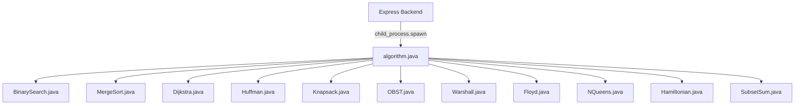

# Sneaker & Streetwear E-Commerce Platform with Java Algorithms Integration

This plan details the design and step-by-step implementation of a modern, premium sneaker e-commerce platform (codename: **SOLEFORCE**). The platform integrates a modern React frontend and Node.js/Express backend with a Java-based Algorithms Layer for key e-commerce operations.

---

## User Review Required

Please review the following design and technical proposals:

> [!IMPORTANT]
> **1. Java Integration Mechanism**
> We propose executing the Java algorithms as a **CLI child process** (`java -cp algorithms algorithm <action> <input_json>`) from the Express backend. This keeps the deployment simple, requiring only JDK installed on the host machine without the overhead of running a full Spring Boot server. Let us know if you prefer a REST API (Spring Boot) instead.
>
> **2. Styling Choice (Tailwind CSS vs. SCSS)**
> We propose using **Tailwind CSS v3** (or v4 depending on your preference) along with **CSS Variables** for custom theme management (dark/neon aesthetic). Since Tailwind requires confirmation, please verify if Tailwind v3 is acceptable or if you prefer SCSS.
>
> **3. Database Setup**
> We propose using **MongoDB** (via MongoDB Atlas or local MongoDB). If MongoDB is not locally installed, we can use a local file-based database (such as Lowdb or NeDB) or SQLite during development to ensure zero-setup runnability. Let us know your preference.

---

## Open Questions

1. **Java Class Naming**: Standard Java conventions require classes to be Capitalized (e.g., `Algorithm`). The prompt specified `algorithm.java` (lowercase). Should the Java file and class name be lowercase `algorithm.java` and `class algorithm` to match the prompt exactly, or should we use standard `Algorithm.java`? *(We recommend using `algorithm.java`/`class algorithm` if you want strict compliance with the prompt, but standard Java is `Algorithm`).*
2. **MongoDB Access**: Do you have a local MongoDB instance running, or should we provide a connection string configuration for MongoDB Atlas in the `.env` file?
3. **N-Queens Visualizer**: How would you like the N-Queens problem to be showcased in the frontend? We propose an interactive "Warehouse Shelf Layout Optimizer" or a standalone visualizer page inside the Admin Dashboard to show how grid spaces are allocated.

---

## Proposed Changes

### Component 1: Algorithms Layer (Java)

This layer will reside in `/algorithms` and contain the centralized `algorithm.java` controller and the individual algorithm implementations. The controller will read inputs, invoke the correct class, and output JSON string results.



#### [NEW] [algorithm.java](file:///c:/Users/sree6/.vscode/My%20Projects/algorithms/algorithm.java)
- Entry point for CLI execution.
- Parses command-line args: `java algorithm <algorithm_name> <json_params>`.
- Dispatches execution to specific classes and prints JSON-formatted output to `System.out`.

#### [NEW] [BinarySearch.java](file:///c:/Users/sree6/.vscode/My%20Projects/algorithms/BinarySearch.java)
- Searches for a product in a sorted list by ID or Name.

#### [NEW] [MergeSort.java](file:///c:/Users/sree6/.vscode/My%20Projects/algorithms/MergeSort.java)
- Sorts list of products by price, rating, or date.

#### [NEW] [Dijkstra.java](file:///c:/Users/sree6/.vscode/My%20Projects/algorithms/Dijkstra.java)
- Delivery route optimization: Finds the shortest path from a warehouse to a customer destination node in a weighted graph.

#### [NEW] [Huffman.java](file:///c:/Users/sree6/.vscode/My%20Projects/algorithms/Huffman.java)
- Compresses/Decompresses invoice text or transaction receipts for storage optimization.

#### [NEW] [Knapsack.java](file:///c:/Users/sree6/.vscode/My%20Projects/algorithms/Knapsack.java)
- Budget-based cart optimizer: Selects items from a wishlist/cart to maximize rating/satisfaction within a given budget.

#### [NEW] [OBST.java](file:///c:/Users/sree6/.vscode/My%20Projects/algorithms/OBST.java)
- Optimal Binary Search Tree: Arranges product search keywords based on lookup frequencies to minimize search times.

#### [NEW] [Warshall.java](file:///c:/Users/sree6/.vscode/My%20Projects/algorithms/Warshall.java)
- Transitive Closure: Determines category reachability (e.g., resolving if Category A transitively links to Category B).

#### [NEW] [Floyd.java](file:///c:/Users/sree6/.vscode/My%20Projects/algorithms/Floyd.java)
- All-Pairs Shortest Path: Computes routing distances between all warehouses/distribution centers.

#### [NEW] [NQueens.java](file:///c:/Users/sree6/.vscode/My%20Projects/algorithms/NQueens.java)
- Visualizes non-conflicting placement of "special display stands" or "security cameras" in an $N \times N$ warehouse/store grid.

#### [NEW] [Hamiltonian.java](file:///c:/Users/sree6/.vscode/My%20Projects/algorithms/Hamiltonian.java)
- Determines if a delivery truck can visit a series of customer drop-off points exactly once and return to the warehouse (TSP route validation).

#### [NEW] [SubsetSum.java](file:///c:/Users/sree6/.vscode/My%20Projects/algorithms/SubsetSum.java)
- Finds subsets of items that sum up exactly to a specific coupon discount target or a threshold for free shipping.

---

### Component 2: Backend (Node.js & Express)

The backend will handle REST APIs for e-commerce features (users, products, cart, wishlist, orders) and orchestrate calls to the Java algorithms.

#### [NEW] [package.json](file:///c:/Users/sree6/.vscode/My%20Projects/server/package.json)
- Configures server dependencies (`express`, `mongoose`, `jsonwebtoken`, `bcryptjs`, `cors`, `dotenv`).

#### [NEW] [server.js](file:///c:/Users/sree6/.vscode/My%20Projects/server/server.js)
- Server entry point, configures Express, connects to database, sets up middleware.

#### [NEW] [algorithmRunner.js](file:///c:/Users/sree6/.vscode/My%20Projects/server/utils/algorithmRunner.js)
- Utility to spawn the Java process, pass inputs via arguments/stdin, and capture output.

#### [NEW] Controllers & Routes
- `/routes/auth.js` & `/controllers/authController.js` (JWT Login/Register)
- `/routes/products.js` & `/controllers/productController.js` (Includes search/sort via Java BinarySearch/MergeSort)
- `/routes/orders.js` & `/controllers/orderController.js` (Includes route & discount calculations via Java Dijkstra/Knapsack/SubsetSum)
- `/routes/analytics.js` & `/controllers/analyticsController.js` (Exposes N-Queens, Huffman, Floyd, and OBST visualizations)

---

### Component 3: Frontend (React & CSS)

A premium frontend utilizing Vite, showcasing a dark luxury streetwear aesthetic with neon accents, responsive layout, and interactive elements.

#### [NEW] Vite & Tailwind Setup
- `/client/package.json`
- `/client/tailwind.config.js` (if Tailwind is approved) or `/client/src/index.css` (custom CSS variables & keyframe animations).

#### [NEW] Pages & UI Elements
- **Home/Hero Page**: Glassmorphism design, floating sneaker, modern grids, scroll-triggered animations.
- **Shop / Product Listing Page**: Interactive search bar (powered by Java BinarySearch) and sorting filters (powered by Java MergeSort).
- **Product Details Page**: Quick info, sizing selections, wishlist toggles, and rich hover animations.
- **Cart & Checkout**: Persistent cart, budget-based optimization panel (Knapsack optimizer), and shipping route optimization visualizer (Dijkstra).
- **Admin & Algorithms Dashboard**: A dedicated panel for administrative tasks and real-time visualization of the 11 Java algorithms (e.g. N-Queens board rendering, Dijkstra routing graph, Huffman tree visualization).

---

## Verification Plan

### Automated Verification
1. **Java Unit Tests**: Run local compilations and CLI test invocations to verify algorithm correctness:
   ```bash
   javac algorithms/*.java
   java -cp algorithms algorithm test_binary_search
   ```
2. **Backend Tests**: Verify REST endpoints using `curl` or server logs:
   - Registration, login, JWT token verification.
   - Algorithm endpoints (evaluating sorting, routing, optimization outputs).

### Manual Verification
1. Run both server and client:
   - Server: `npm run dev` in `/server`
   - Client: `npm run dev` in `/client`
2. Interactive walkthrough of:
   - High-quality dark/neon theme, responsive cards, and transition effects.
   - Running the algorithms panel to see Dijkstra, N-Queens, and Huffman code trees visualized dynamically.
